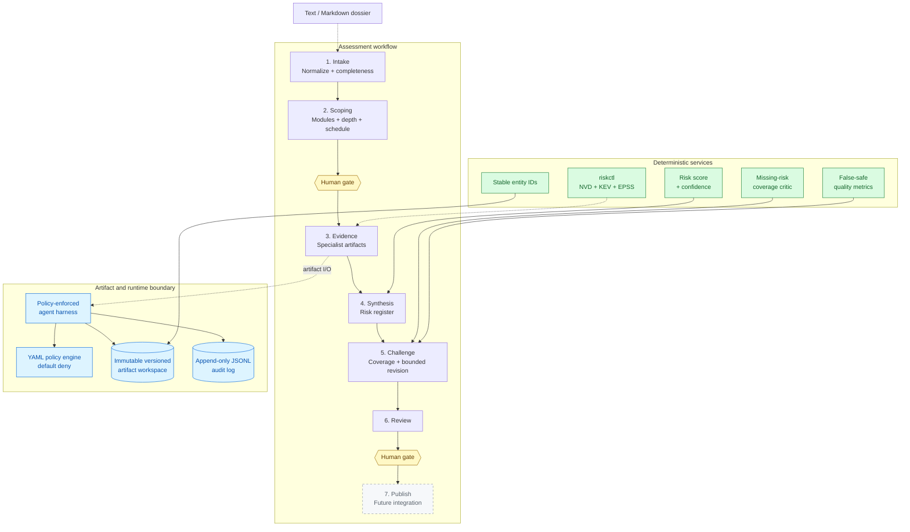
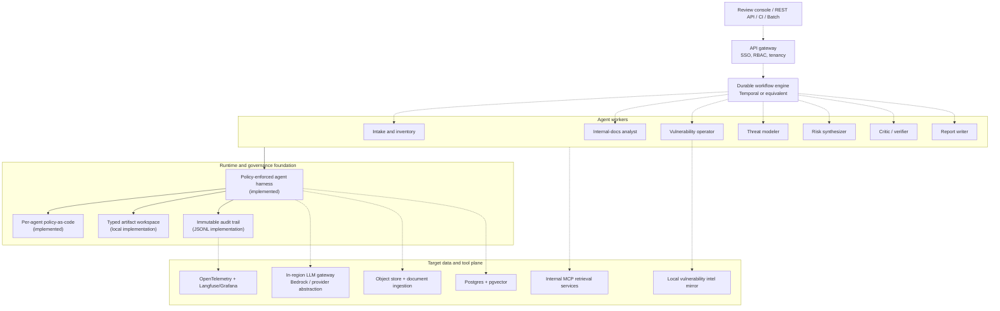

# RiskOS

RiskOS is an evidence-backed IT risk assessment foundation for regulated
environments. It is designed around deterministic workflows, typed artifacts,
least-privilege agents, reproducible scoring, and explicit human approval
gates.

The project is currently an early foundation, not a production assessment
platform. The implemented code establishes the contracts that later document
ingestion, model workers, durable orchestration, and review interfaces will use.

## Design Principles

- **Workflow first, agents second.** Code controls assessment phases and gates;
  models operate only inside bounded tasks.
- **Artifacts over conversations.** Agents exchange validated, versioned
  Pydantic artifacts instead of sharing context windows.
- **Evidence-backed findings.** Findings link to evidence and confidence is
  computed from evidence properties, not model self-assessment.
- **Least privilege by default.** Every agent read, write, and execute request
  is checked against policy-as-code and recorded in the audit log.
- **Humans gate consequential transitions.** Scope confirmation and final
  review require explicit human approval.
- **False-safe prevention.** Deterministic coverage rules detect risks that
  should exist but are missing from a register.

See [ROADMAP.md](ROADMAP.md) for the full architecture and delivery plan.

## Current Architecture

The implemented foundation covers typed inventory and finding models,
deterministic intake and scoping, policy-enforced artifact access, risk scoring,
coverage challenge, evaluation metrics, and a local vulnerability intelligence
CLI.



## Target Architecture

The roadmap grows the current foundation into a durable, multi-agent platform.
Planned components are shown with dashed connections.



## Implemented Capabilities

| Area | Current capability |
|---|---|
| Identity | Stable deterministic IDs for systems, components, findings, evidence, artifacts, and workflow objects |
| Schemas | Typed entities, inventories, evidence, findings, scopes, and risk registers |
| Intake | Text/Markdown normalization, deterministic classification and chunking, plus rule-coded completeness checks |
| Scoping | DORA, privacy, GenAI, and adversary module activation; fast-track/full-depth selection |
| Workflow | Ordered assessment phases, serializable state, and mandatory human gates |
| Runtime | Policy-enforced artifact access, immutable versions, path validation, and append-only audit events |
| Scoring | Versioned deterministic risk matrix and evidence-derived confidence |
| Challenge | Missing-risk coverage rules and a bounded revision loop |
| Evaluation | False-safe rate, unsupported-critical rate, precision, and score agreement |
| Vulnerability intelligence | JSON-first `riskctl` over a local NVD, CISA KEV, and EPSS fixture mirror |

## Quick Start

RiskOS requires Python 3.12 or newer.

```powershell
python -m pip install -e ".[dev]"
python -m pytest -q
```

Run the vulnerability intelligence CLI against the included sample mirror:

```powershell
riskctl cve get CVE-2026-0001
riskctl kev check CVE-2026-0001
riskctl epss get CVE-2026-0002
riskctl triage CVE-2026-0001 CVE-2026-0002 CVE-1999-9999
```

Run the checked-in regression corpus and enforce release thresholds:

```powershell
riskeval evals/corpus --thresholds config/eval_thresholds.yaml
```

Normalize a local text/Markdown dossier into a typed document corpus:

```powershell
riskingest path/to/dossier --assessment-id asm-example --output corpus.json
```

Use another local mirror by setting `RISKOS_MIRROR_DIR`:

```powershell
$env:RISKOS_MIRROR_DIR = "C:\path\to\mirror"
riskctl triage CVE-2026-0001
```

## Core Usage

### Intake and scoping

```python
from riskos.intake import assess_completeness
from riskos.scoping import scope_assessment

intake = assess_completeness(inventory)
if intake.complete:
    scope = scope_assessment(inventory, intake)
    print(scope.modules, scope.depth, scope.scheduled_agents)
else:
    for requirement in intake.requirements:
        print(requirement.rule_id, requirement.description)
```

### Policy-enforced artifact access

```python
from riskos.policy import PolicyEngine
from riskos.runtime import AgentHarness, ArtifactWorkspace, JsonlAuditLog

policy = PolicyEngine.load_dir("policies")
workspace = ArtifactWorkspace("workspaces", assessment_id)
audit_log = JsonlAuditLog("workspaces/audit.jsonl")

harness = AgentHarness("risk_synthesizer", policy, workspace, audit_log)
register = harness.read_artifact(
    "risk_register",
    artifact_id,
    RiskRegister,
)
```

Denied actions raise `PolicyError` and are still recorded in the audit log.

### Workflow gates

```python
from riskos.workflow import AssessmentWorkflow

workflow = AssessmentWorkflow.start(assessment_id)
workflow.advance("intake_worker")  # intake -> scoping

# Scoping cannot advance without explicit human approval.
workflow.advance("risk.officer@example.test", human_approved=True)
```

## Repository Layout

```text
config/                 Versioned deterministic risk methodology
data/mirror/            Sample local vulnerability intelligence mirror
evals/corpus/           Versioned dev, regression, and holdout eval cases
policies/               Per-agent least-privilege YAML policies
src/riskos/
  cli/                  riskctl vulnerability intelligence CLI
  critic/               Deterministic missing-risk coverage checks
  evals/                Quality metrics, corpus runner, and release gates
  intake/               Document normalization and intake completeness gate
  policy/               Policy-as-code engine
  runtime/              Agent harness, artifact workspace, audit log
  schemas/              Typed entities and workflow artifacts
  scoping/              Conditional module and depth selection
  scoring/              Risk score and confidence calculation
  workflow/             Phase state machine and bounded challenge loop
tests/                  Unit and behavioral regression suite
ROADMAP.md              Target architecture and delivery roadmap
```

## Security Model

- Policies are default-deny and explicit prohibitions override allow rules.
- Agents that consume raw documents cannot publish reports or execute outward
  side effects.
- The synthesizer and scope engine consume structured artifacts, not raw
  untrusted documents.
- Normalized document chunks remain untrusted and are denied to the
  synthesizer, critic, and report writer by policy.
- Artifact versions are immutable and scoped to one assessment workspace.
- Artifact path segments are validated to prevent workspace traversal.
- Allowed and denied runtime operations are both auditable.

The local runtime is a development implementation. Production deployment still
requires hardened sandboxing, durable workflow execution, tenant isolation,
WORM audit storage, secret management, and in-region model serving.

## Roadmap Status

**Implemented foundation**

- Typed artifacts and stable entity IDs
- Minimal policy-as-code and enforcement harness
- Text/Markdown intake normalization, completeness, and assessment scoping
- Human-gated workflow state machine
- Deterministic scoring, confidence, coverage checks, and eval metrics
- Local `riskctl` vulnerability intelligence CLI

**Next major work**

- Add PDF/DOCX/diagram adapters and extract asset/data-flow inventories
- Grow the golden assessment corpus and add phase-level extraction evals
- Provider-abstracted LLM gateway and bounded model worker loop
- Phase 1 analyst workflow and reviewer label capture
- Durable orchestration, persistent data stores, and review console

## Development

Run the full verification suite:

```powershell
python -m pytest -q
riskeval evals/corpus --thresholds config/eval_thresholds.yaml
python -m compileall -q src tests
git diff --check
```

Methodology changes belong in `config/risk_matrix.yaml` and should be treated
as reviewed risk-methodology changes, not tuning adjustments.
